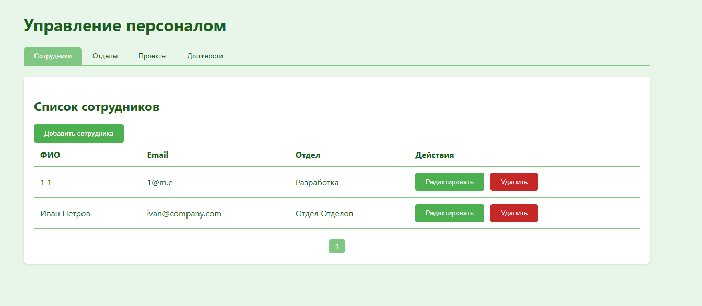
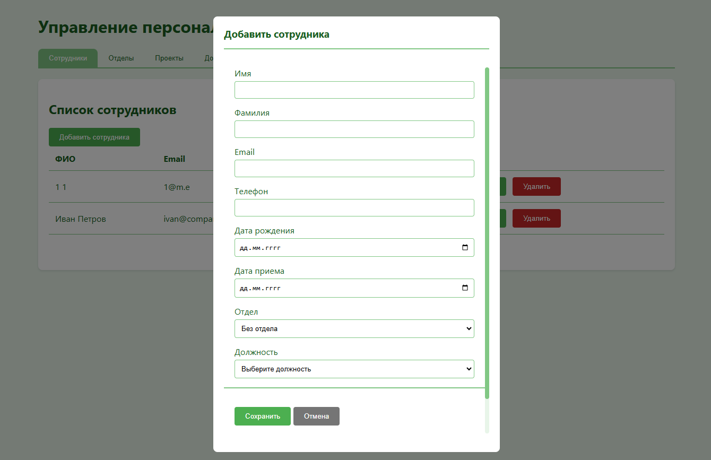
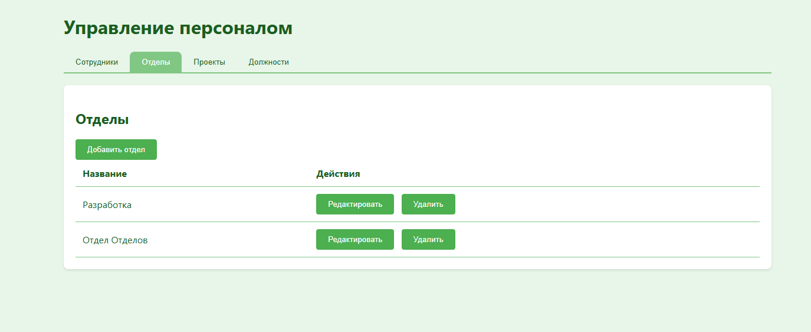
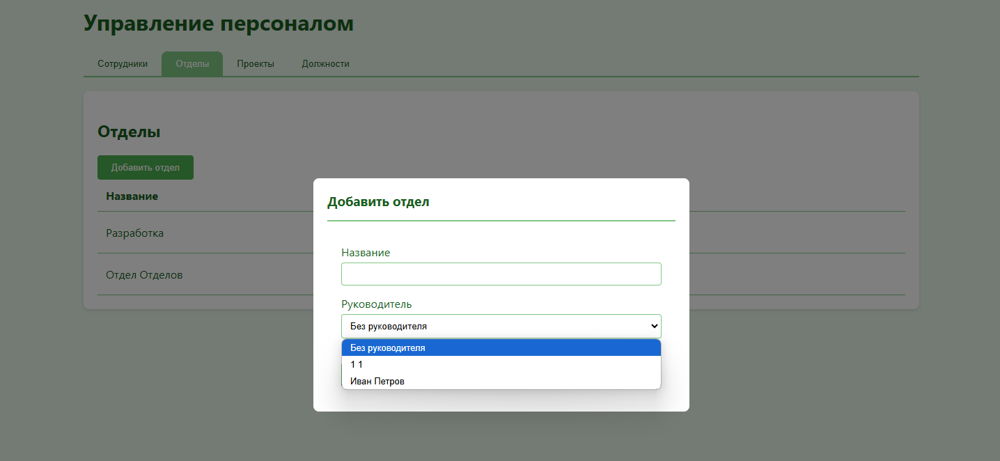
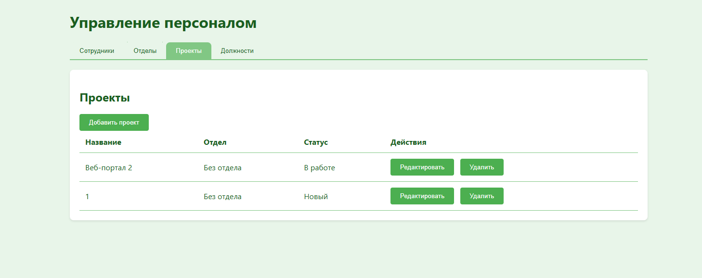
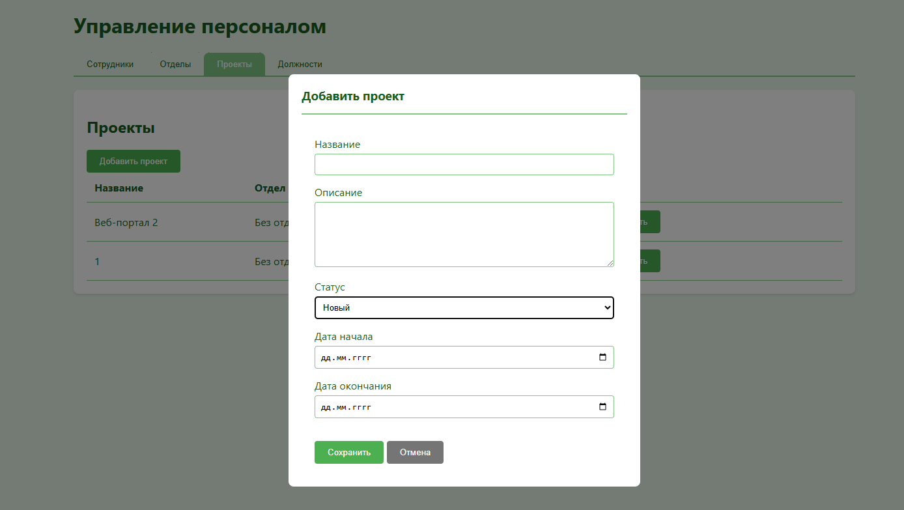
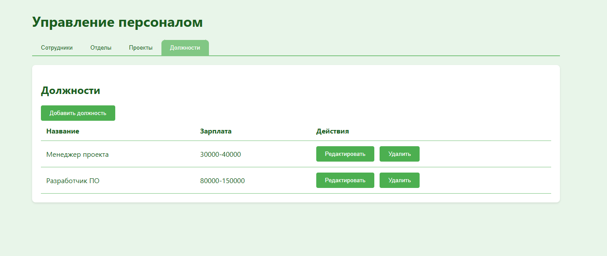
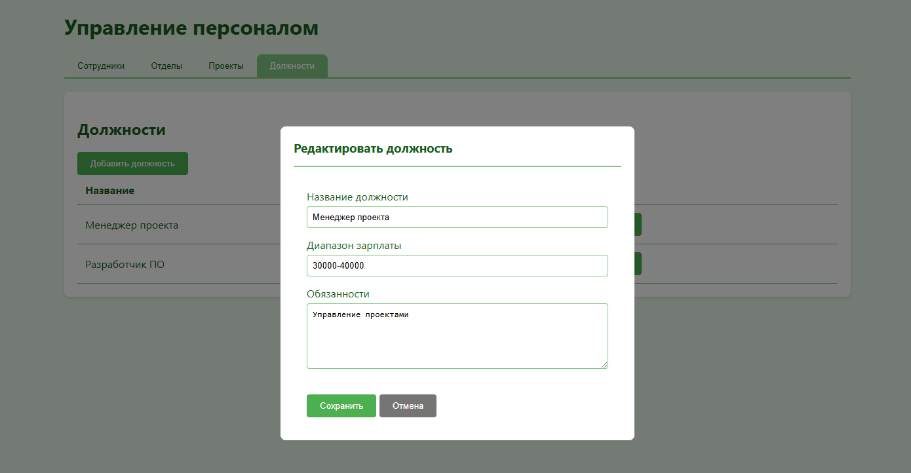

# InnovateSoft HR - Система управления персоналом

Веб-приложение для управления персоналом, отделами и проектами компании.

## Функциональность

- Управление сотрудниками (создание, редактирование, удаление)
- Управление отделами и назначение руководителей
- Управление проектами и участниками
- Управление должностями и зарплатными диапазонами

## Технологии

### Backend
- ASP.NET Core 8.0
- Entity Framework Core
- PostgreSQL
- WebSocket для real-time обновлений

### Frontend  
- HTML5
- CSS3
- JavaScript (чистый, без фреймворков)
- WebSocket для связи с сервером

## Запуск проекта

1. Установите [.NET 8 SDK](https://dotnet.microsoft.com/download/dotnet/8.0)
2. Установите [PostgreSQL](https://www.postgresql.org/download/)
3. Склонируйте репозиторий
4. Создайте базу данных и обновите строку подключения в `appsettings.json`
5. Выполните миграции:
    ```sh
    dotnet ef database update
    ```
6. Запустите проект:
    ```sh
    dotnet run
    ```
7. Откройте [http://localhost:5001](http://localhost:5001) в браузере

## Структура проекта

<pre>
├── Config/             # Конфигурация приложения
├── Data/               # Контекст БД и модели
├── Extensions/         # Расширения сервисов
├── Handlers/           # WebSocket обработчики
├── Models/             # Модели данных
├── Services/           # Бизнес-логика
└── wwwroot/           # Клиентская часть
    ├── index.html
    ├── style.css      
    └── script.js
</pre>


## Скриншоты


*Страница со списком сотрудников и действий с ними (добавление, редактирование, удаление).*




*Страница со списком отделов*












